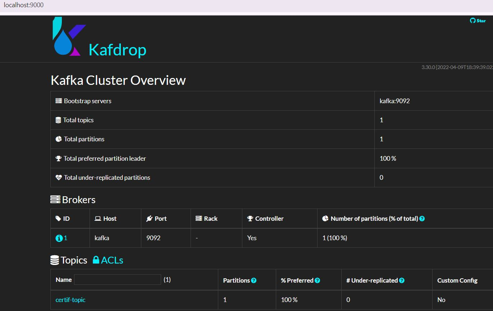

# CertifEv - Plateforme de Recrutement Technique

**La plateforme qui valide les compétences techniques avant l'embauche**

## 📖 Table des matières

- [🌟 Fonctionnalités](#-fonctionnalités)
- [🏗 Architecture](#-architecture)
- [📂 Structure du Projet](#-structure-du-projet)
- [🛠 Outils Utilisés](#-outils-utilisés)
- [🔄 Workflow](#-workflow)
- [🚀 Démarrage Rapide](#-démarrage-rapide)
- [🔍 Vérification](#-vérification)
- [📡 Documentation API](#-documentation-api)
- [📸 Captures d'écran](#-captures-décran)
- [🔧 Commandes Techniques](#-commandes-techniques)

## 🌟 Fonctionnalités

- **Validation des Compétences** : Système complet pour évaluer et certifier les compétences techniques
- **Microservices** :
  - 🏷 Service Certificats (gRPC)
  - 💻 Service Compétences (gRPC)
  - 👤 Service Utilisateurs (gRPC)
- **API Gateway** :
  - 🌐 RESTful API
  - 🎯 GraphQL API
- **Messagerie** :
  - 📨 Kafka pour l'échange asynchrone de messages
  - 🖥 Kafdrop pour la visualisation des messages

## 🏗 Architecture


```mermaid
graph TD
    A[Client] --> B[API Gateway]
    B --> C[Certificats Microservice]
    B --> D[Compétences Microservice]
    B --> E[Utilisateurs Microservice]
    C --> F[(MongoDB)]
    D --> F
    E --> F
    B --> G[Kafka Producer]
    G --> H[Kafka Broker]
    H --> I[Kafka Consumer]
    I --> J[Kafdrop UI]
```

## 📂 Structure du Projet

```
certifev/
├── api/
│   ├── apiGateway.js         # API Gateway principal
│   ├── resolvers.js          # Résolveurs GraphQL
│   ├── schema.js             # Schéma GraphQL
├── consumer/
│   ├── consumer.js           # Consumer Kafka
│   ├── Dockerfile
│   ├── package.json
├── producer/
│   ├── producer.js           # Producer Kafka
│   ├── Dockerfile
│   ├── package.json
├── protos/
│   ├── certificat.proto      # Définition gRPC Certificats
│   ├── competence.proto      # Définition gRPC Compétences
│   ├── user.proto            # Définition gRPC Utilisateurs
├── services/
│   ├── certificatMicroservice.js  # Service Certificats
│   ├── competenceMicroservice.js  # Service Compétences
│   ├── userMicroservice.js        # Service Utilisateurs
├── .env                      # Variables d'environnement
├── docker-compose.yml        # Configuration Docker
├── package.json              # Dépendances principales
└── README.md                 # Ce fichier
```

## 🛠 Outils Utilisés

- **Backend**:
  - 
  - 
  - 
  - 
  
- **Base de données**:
  - 
  
- **Messagerie**:
  - 
  - 
  
- **Conteneurisation**:
  - 
  - 

## 🔄 Workflow

1. **Client** envoie une requête à l'API Gateway
2. **API Gateway** route la requête vers le microservice approprié
3. **Microservice** traite la requête et interagit avec MongoDB
4. Pour les événements asynchrones:
   - Le microservice publie un message via **Kafka Producer**
   - **Kafka Broker** distribue le message
   - **Kafka Consumer** traite le message
5. Les résultats sont retournés au client via l'API Gateway

## 🚀 Démarrage Rapide

### Prérequis

- Docker 20.10+
- Docker Compose 2.17+
- Node.js 18+

### 🐳 Avec Docker Compose

```bash
# Cloner le dépôt
git clone https://github.com/votre-repo/certifev.git
cd certifev

# Démarrer les services
docker-compose up -d --build

# Vérifier les services
docker-compose ps
```

### 📡 API Documentation

#### Endpoints REST

**Certificats**:
- `GET /certificats` - Lister les certificats
- `GET /certificats/:id` - Obtenir un certificat
- `POST /certificats` - Créer un certificat
- `PUT /certificats/:id` - Mettre à jour
- `DELETE /certificats/:id` - Supprimer

**Compétences**:
- `GET /competences` - Lister les compétences
- `GET /competences/:id` - Obtenir une compétence
- `POST /competences` - Créer une compétence
- `PUT /competences/:id` - Mettre à jour
- `DELETE /competences/:id` - Supprimer

**Utilisateurs**:
- `GET /users/:id` - Obtenir un utilisateur
- `POST /users` - Créer un utilisateur

#### GraphQL

Accéder à l'interface GraphQL: `http://localhost:3005/graphql`

Exemple de requête:
```graphql
query {
  certificats(query: "AWS") {
    id
    nom
    organisation
  }
}
```

## 📸 Captures d'écran

### Kafdrop Dashboard


### Test API avec Postman
Test API avec Postman


### GraphQL Playground


### Docker Desktop


## 🔧 Commandes Techniques

### Gestion des Services

```bash
# Démarrer tous les services
docker-compose up -d

# Arrêter tous les services
docker-compose down

# Voir les logs
docker-compose logs -f
```

### Kafka

```bash
# Créer un topic
docker exec -it kafka kafka-topics --create \
  --topic certif-topic \
  --bootstrap-server localhost:9092 \
  --partitions 1 \
  --replication-factor 1

# Lister les topics
docker exec -it kafka kafka-topics --list \
  --bootstrap-server localhost:9092

# Producer console
docker exec -it kafka kafka-console-producer \
  --bootstrap-server localhost:9092 \
  --topic certif-topic

# Consumer console
docker exec -it kafka kafka-console-consumer \
  --bootstrap-server localhost:9092 \
  --topic certif-topic \
  --from-beginning
```

### Installation des Dépendances

```bash
npm init -y
npm install express apollo-server graphql mongoose kafkajs @grpc/grpc-js @grpc/proto-loader

# Pour le développement (outils supplémentaires)
npm install --save-dev nodemon prettier eslint

# Dans le dossier producer/
npm install kafkajs

# Dans le dossier consumer/
npm install kafkajs mongoose
# Installer les dépendances principales
npm install

# Installer les dépendances du producer
cd producer && npm install

# Installer les dépendances du consumer
cd ../consumer && npm install
```

## 🔍 Vérification

Accéder aux interfaces:
- **Kafdrop**: [http://localhost:9000](http://localhost:9000)
- **GraphQL Playground**: [http://localhost:3005/graphql](http://localhost:3005/graphql)
- **API REST**: [http://localhost:3005](http://localhost:3005)

## ⚡ Démarrage des Microservices Individuels

| Service          | Port  | Description                     |
|------------------|-------|---------------------------------|
| API Gateway      | 3005  | Point d'entrée principal        |
| Certificats      | 50051 | Gestion des certifications     |
| Compétences      | 50052 | Gestion des compétences        |
| Utilisateurs     | 50053 | Gestion des utilisateurs       |
| Kafka            | 9092  | Broker Kafka                   |
| Kafdrop          | 9000  | Interface de visualisation Kafka |

---


##📄 License
Ce projet est sous licence MIT
**CertifEv** © 2025 - Plateforme de validation des compétences techniques


